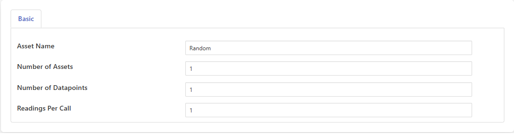

.. Images

Benchmark
=========

The *fledge-south-benchmark* plugin to generate simulated data for benchmark tests.

+---------------+
| |benchmark_1| |
+---------------+

    - **Asset Name**: Asset name prefix

    - **Number of Assets**: Number of unique assets to simulate

    - **Number of Datapoints**: Number of unique datapoints in each simulated asset

    - **Readings Per Call**: Number of readings to be returned per poll call